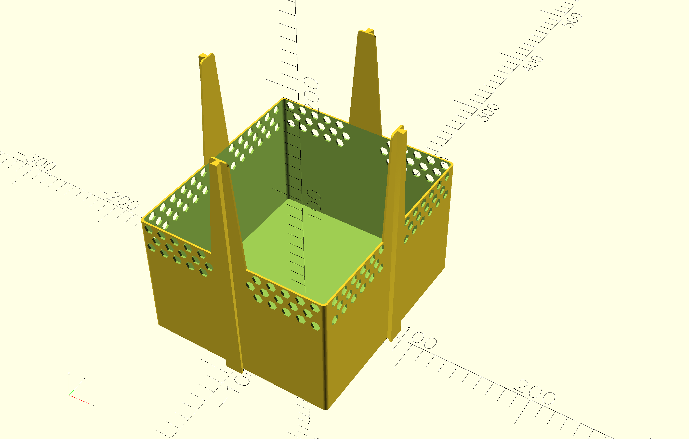
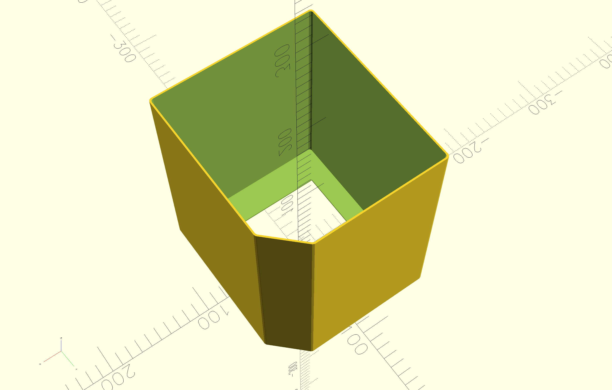
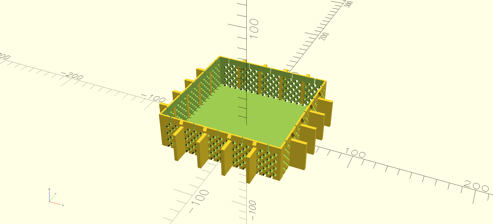
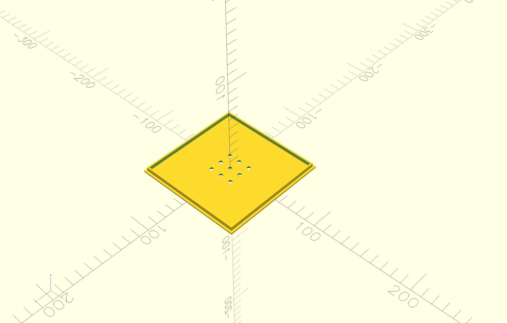

# modular_garden

A collection of **OpenSCAD scripts** for generating modular pots for a kitchen garden system.

## Getting Started

- Open `pot.scad` to preview the full assembled system  
- Open individual `*_render.scad` files to export parts as STL  

---

## Parts

The system currently consists of four main components:

- **Shell**
- **Insert**
- **Foot**
- **Foot Cap**

---

## Components

### The Shell

The shell is the outer container that holds the entire system. Water is poured directly into the shell, so ensure it is watertight after printing (apply sealing if necessary).

Each side features **dovetail joints**, which allow you to:

- Extend the system with additional modules  
- Attach plant or lighting supports  
- Connect multiple units together  
- Add decorative elements

  

  

---

### The Insert

The insert is the inner growing pot. It is filled with soil, LECA, or other growing media, and holds the plant itself.

The insert is designed to be attached to the foot via snap fit joint after printing. These parts are separate due to 3D printing constraints.

  

 

---

### The Foot

The foot forms the interface between the water in the shell and the growing medium in the insert.

It is permanently attached to the insert after printing with snap fit joint.

  

 

---

### The Foot Cap

The foot cap enables **wick-based watering**. It contains perforations that allow wicks to pass through and transport water from the reservoir to the soil.

  

 

---

## Setup

Two main configurations are currently supported:

- **LECA-based**
- **Wick-based**

In both setups, use the **cut-off corner of the insert** to pour water into the shell.

> 💡 Tip: Print the shell with a **translucent filament** to easily monitor water levels.

---

## LECA Setup

1. Fill the foot with LECA balls  
2. Fill the rest of the insert with soil  
3. Fill the shell with water  

The LECA acts as a passive medium, drawing water upward into the soil.

---

## Wick Setup

1. Thread the wick through the perforations in the foot cap  
2. Ensure one end reaches the water and the other reaches the soil  
3. Attach the foot cap  
4. Fill the insert with soil  

The wick transports water directly from the reservoir into the growing medium.
